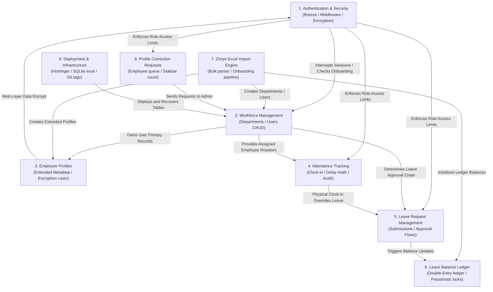
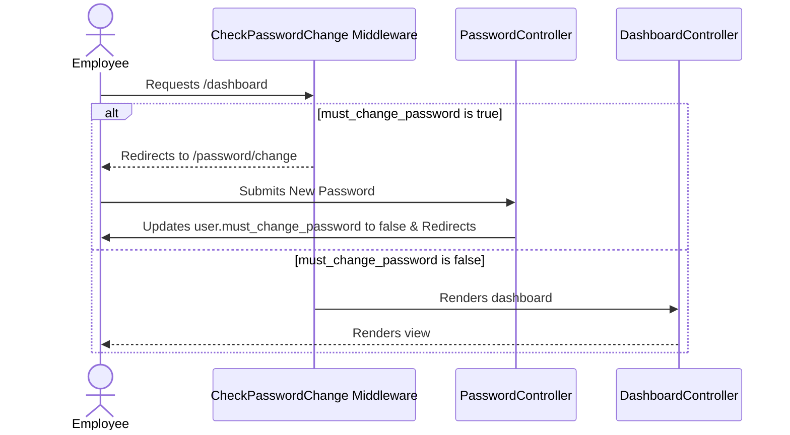
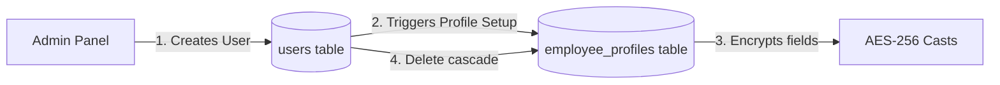
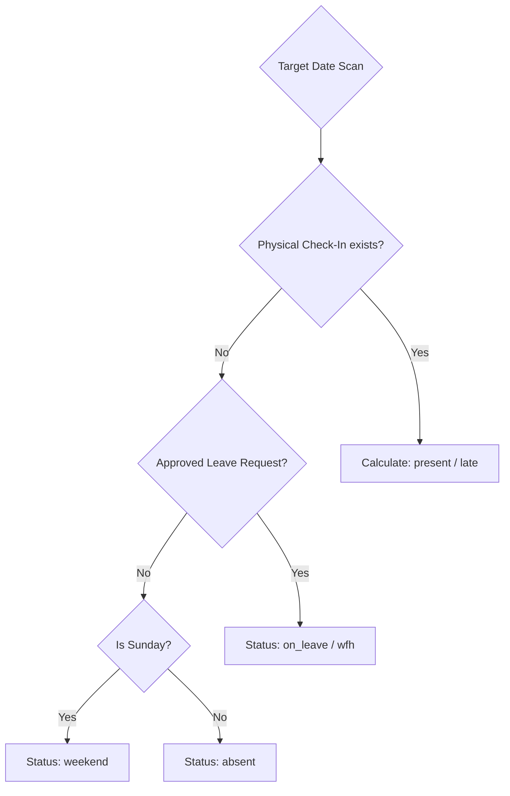
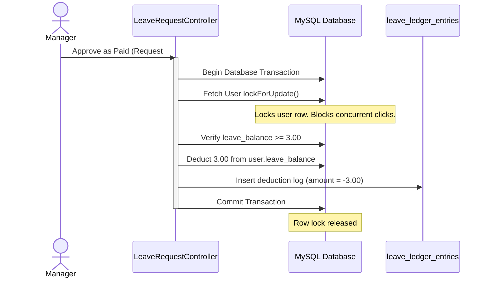
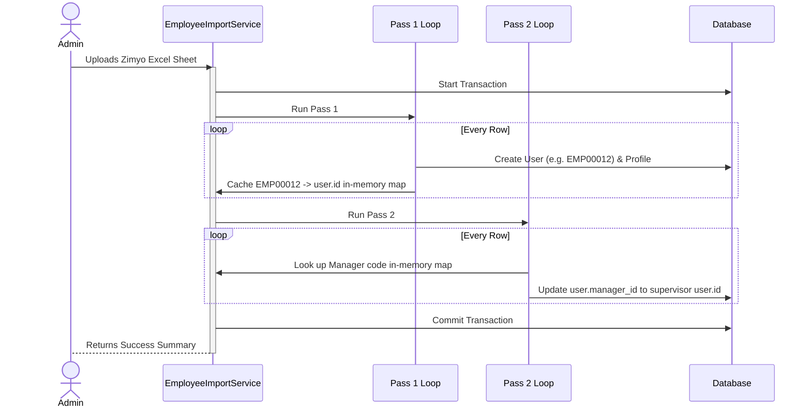

# AMS-V1 — System Architecture Map

This document describes the high-level subsystem relationships, data flow boundaries, and operational dependencies of the Attendance Management System Version 1 (AMS-V1).

---

## 1. Subsystem Interaction Model

The diagram below shows how the 9 major subsystems interact with each other and route their respective data dependencies:

---

## 2. Subsystem Relationships & Data Flows

### Authentication & Security Relationships
* **Authentication → Workforce Management & Dashboards:** 
  * The `CheckPasswordChange` middleware intercepts all incoming requests to workforce and dashboard routes.
  * If the authenticated user has `must_change_password = true`, they are blocked and redirected to the password change view.
* **Authentication → Role-Based Access Control (RBAC):**
  * Controllers map user roles (`admin`, `manager`, `employee`) to restrict query boundaries.
  * Route middleware (`EnsureUserIsAdmin`) restricts import routes, correction queues, and audit dashboards to admin staff.

---

### Department & Workforce Management Relationships
* **Workforce Management → Employee Profiles:**
  * When a new User is created under the workforce management controllers, a corresponding 1:1 mapped `employee_profiles` record is automatically initialized by the service layer.
* **Workforce Management → Attendance:**
  * Daily check-in lists and late audits use the department filters (`department_id`) and name search inputs from users to display roster attendance.
* **Workforce Management → Leave Management:**
  * When a standard employee applies for a leave request, the system checks their `manager_id` reporting chain to route approval actions to their direct supervisor.

---

### Employee Profiles Relationships
* **Employee Profiles → Authentication & Security:**
  * Sensitive data attributes mapped in [EmployeeProfile](file:///c:/Users/Lenovo/AMS-V1/app/Models/EmployeeProfile.php) use the Laravel encrypter configuration from the core config keys, ensuring decryption fails if the `APP_KEY` environment value changes.
* **Employee Profiles → Zimyo Import Engine:**
  * The Zimyo import parser directly instantiates and populates [EmployeeProfile](file:///c:/Users/Lenovo/AMS-V1/app/Models/EmployeeProfile.php) rows during Pass 1, writing personal and bank data.
* **Employee Profiles → Profile Correction Requests:**
  * When an employee submits a correction request, it points to a specific field in their [EmployeeProfile](file:///c:/Users/Lenovo/AMS-V1/app/Models/EmployeeProfile.php) table (e.g. `bank_name` or `pan`). When resolved by an Admin, the profile record is updated directly.

---

### Attendance Tracking & Auditing Relationships
* **Attendance Tracking → Authentication & Security:**
  * Endpoint authentication is enforced globally by standard `auth` middleware. Role limits are enforced inside the controllers (e.g. `EnsureUserIsAdmin` restricts access to the global audit logs dashboard `/admin/attendance-logs`).
* **Attendance Tracking → Leave Request Management (Rule B Overrides):**
  * When executing dashboard status filters, the `AttendanceService` queries [LeaveRequest](file:///c:/Users/Lenovo/AMS-V1/app/Models/LeaveRequest.php) to determine if an employee has an approved leave or WFH request. If no check-in exists, the status automatically shows as `on_leave` or `wfh` rather than `absent`.
  * If the employee physically clocks in (creating an active check-in row), the physical check-in overrides the approved leave, setting the day's status to `present` or `late`.

---

### Leave Request Management Relationships
* **Leave Management → Leave Balance Ledger:**
  * When a Manager/Admin reviews a leave request and clicks **Approve as Paid**, the transaction logic deducts the request's `total_days` from the user's `leave_balance` and logs a matching `deduction` ledger entry.
  * If a user cancels an approved paid leave, the cancellation controller refunds the amount back to `leave_balance` and records a `refund` ledger entry. Approvals as **Unpaid Leave** bypass balance changes.
* **Leave Management → Workforce Management:**
  * Managers can only see and approve leave requests for employees who are assigned directly to them via the `manager_id` foreign key.

---

### Leave Balance Ledger Relationships
* **Leave Balance Ledger → Authentication & Security (Concurrency Safeguards):**
  * Approving requests runs inside database transactions with pessimistic locks (`lockForUpdate()`), holding user records until updates are committed. This blocks concurrent login sessions from performing duplicate balance alterations.
* **Leave Balance Ledger → Zimyo Import Engine:**
  * When bulk importing new employees, the import pipeline directly calls [LeaveBalanceService](file:///c:/Users/Lenovo/AMS-V1/app/Services/LeaveBalanceService.php) to initialize their opening balance ledger line.
* **Leave Balance Ledger → Operations & Cron Schedule:**
  * The monthly accrual task is run as an automated cron command. The command checks for matching ledger logs in the current calendar month to guarantee idempotency.

---

### Zimyo Excel Import Engine Relationships
* **Zimyo Import Engine → Workforce Management & Profiles:**
  * Bulk sheet parsing creates new User rows and `employee_profiles` rows under a shared database transaction block. Missing departments are identified and created on the fly.
* **Zimyo Import Engine → Authentication & Security:**
  * Newly created users are assigned a hashed version of the system default password (retrieved via `employees.default_employee_password` configuration mapping from the environment's `DEFAULT_EMPLOYEE_PASSWORD`) and flagged with `must_change_password = true`, forcing them into the security update workflow on first login.
* **Zimyo Import Engine → Leave Balance Ledger:**
  * Every created employee has their initial 2.00 leave credit initialized by a direct invocation of the ledger initialization services, recording an `opening_balance` entry.

---

### Profile Correction Requests Relationships
* **Profile Corrections → Workforce Management (HR Admin Resolution):**
  * Correction requests do not edit profiles directly. Instead, when an Admin resolves a request, the Admin copies the validated values to the target [EmployeeProfile](file:///c:/Users/Lenovo/AMS-V1/app/Models/EmployeeProfile.php) or [User](file:///c:/Users/Lenovo/AMS-V1/app/Models/User.php) record and marks the request as resolved.
* **Profile Corrections → User Interface (Badge Alert Counters):**
  * The left sidebar layout file query matches the count of pending correction requests and displays a red badge count alert for logged-in HR Administrators, providing live feedback.

---

### Deployment & Infrastructure Operations Relationships
* **Deployment & Operations → All Subsystems (Database Migrations):**
  * Deployed migrations structure the schema tables, constraints, foreign keys, and indexes for all subsystems (Authentication, Profiles, Attendance, Ledger, Corrections, and Imports).
* **Deployment & Operations → Authentication & Security:**
  * Setting correct `.env` files mapping (e.g. `APP_ENV=production`, `APP_DEBUG=false`, and setting secure `APP_KEY` secrets) locks database encryption casts in the Profiles domain.

---

## 3. High-Level Subsystem Interaction & Data Flow Examples

To help future maintainers and developers understand the execution boundaries, here are detailed walkthroughs of how key subsystems interact, trace transactions, and synchronize data flows.

### Example A: Authentication & Security → Workforce Management
This flow details how session checks intercept workforce navigation and restrict operations:

1. **User Authentication Request:** An employee submits credentials to the `login` endpoint handled by [AuthenticatedSessionController@store](file:///c:/Users/Lenovo/AMS-V1/app/Http/Controllers/Auth/AuthenticatedSessionController.php).
2. **Session Creation:** The system verifies the credentials. If valid, a session is initialized, and the user is redirected to the `/dashboard` route.
3. **Middleware Interception:** The global web routing container passes the request through [CheckPasswordChange](file:///c:/Users/Lenovo/AMS-V1/app/Http/Middleware/CheckPasswordChange.php) middleware.
4. **Credential Expiry Check:** The middleware evaluates the authenticated user's `must_change_password` attribute:
   * **If `true`:** The request is aborted, and the user is redirected to the `/password/change` view. Any attempt to access workforce CRUD directories, directories lists, or dashboard panels is blocked until they submit a new password via [PasswordController@update](file:///c:/Users/Lenovo/AMS-V1/app/Http/Controllers/Auth/PasswordController.php) which resets the database flag to `false`.
   * **If `false`:** The request passes through.
5. **Role-Based Routing Isolation:** If the user attempts to load admin endpoints (such as `/admin/employees`), the request hits [EnsureUserIsAdmin](file:///c:/Users/Lenovo/AMS-V1/app/Http/Middleware/EnsureUserIsAdmin.php). Users without the `admin` role are returned a `403 Unauthorized` page, securing workforce settings.

---

### Example B: Users → Employee Profiles
This flow details the 1:1 mapped lifecycle relationship of primary credentials and detailed HR metadata:

1. **Creation Trigger:** An HR Admin creates a new worker profile. The controller invokes [EmployeeController@store](file:///c:/Users/Lenovo/AMS-V1/app/Http/Controllers/EmployeeController.php).
2. **User Record Insertion:** The transaction creates a primary record in the `users` table containing corporate identifiers (name, official email, employee ID, role, and manager reporting key).
3. **Profile Record Initialization:** Upon successful user record save, the service layer instantiates a matching record in the `employee_profiles` table, mapped 1:1 via the `user_id` foreign key.
4. **Rest-Layer Encrypted Saving:** When profile details (personal, contact, address, banking coordinates, and education) are written, model configuration casts in [EmployeeProfile.php](file:///c:/Users/Lenovo/AMS-V1/app/Models/EmployeeProfile.php) encrypt critical coordinates (Aadhaar, PAN, Bank Account Number, IFSC Code) using the system's `APP_KEY` cipher secret.
5. **Lifecycle Parity (Cascade Delete):** If an administrator deletes a worker via `EmployeeController@destroy`, the relational schema deletes the matching `employee_profiles` table row automatically via database cascade constraints, preventing orphan records.

---

### Example C: Attendance Tracking → Leave Override Rules
This flow details how daily attendance math integrates approved leaves and handles physical overrides (Rule B):

1. **Daily Logs Generation:** When the employee dashboard or manager roster fetches check-in lists, the system executes queries inside [AttendanceService@getDailyAttendanceSummary](file:///c:/Users/Lenovo/AMS-V1/app/Services/AttendanceService.php).
2. **Check-in Record Scan:** The database queries the `attendances` table for records matching the worker and the current date:
   * **Case 1 (No Check-in Record exists):**
     1. The service queries the `leave_requests` table to check if the employee has a request in `approved` status covering the target date.
     2. If an approved leave request exists, the daily status resolved displays as `on_leave` or `wfh` based on the request parameters, preventing the worker from being marked as `absent`.
     3. If no approved request exists, the day is marked as `absent` (unless it is a Sunday, which is skipped under weekend exclusion rules).
   * **Case 2 (Physical Check-in exists):**
     1. If the worker physically clicks **Clock In** (writing a row to the `attendances` table), the physical record overrides the leave request.
     2. The daily status is recalculated as `present` or `late` based on their arrival timestamp compared to the grace period start boundary (09:00 AM or 09:30 AM rules transition).

---

### Example D: Leave Requests → Leave Ledger Entries
This flow details the double-entry transactional tracking of leave credits and pessimistic locking concurrency protections:

1. **Manager Action:** A manager clicks **Approve as Paid** on a pending leave request, posting to [LeaveRequestController@approve](file:///c:/Users/Lenovo/AMS-V1/app/Http/Controllers/LeaveRequestController.php).
2. **Database Transaction Envelope:** The controller wraps the approval routine inside `DB::transaction()`.
3. **Pessimistic Row Lock:** The query fetches the applicant's record using the blocking lock:
   `User::where('id', $applicantId)->lockForUpdate()->firstOrFail();`
   This halts concurrent requests (e.g. double-clicks or multiple supervisors reviewing simultaneously) from modifying this user's balance.
4. **Balance Verification:** The system checks if `users.leave_balance` is greater than or equal to the request's `total_days`. If verification fails, it rolls back the transaction.
5. **Double-Entry Execution:**
   * Deducts `total_days` from `users.leave_balance`.
   * Inserts an audit trail record to the `leave_ledger_entries` table with a negative value (e.g. `amount = -3.00`, `type = 'deduction'`, `description = "Deduction for approved leave request #12"`).
6. **Cancellation & Refund Pipeline:** If the employee cancels this approved paid request, the system locks the user row, restores the balance (`amount = +3.00`), and writes a `refund` ledger record, guaranteeing auditability.

---

### Example E: Import Engine → Users → Employee Profiles → Manager Hierarchy
This flow details the two-pass Excel parser utilized to build complex reporting structures during bulk onboarding migrations:

1. **Uploader Upload:** An administrator posts a Zimyo Excel sheet to [ImportController@handle](file:///c:/Users/Lenovo/AMS-V1/app/Http/Controllers/ImportController.php).
2. **Pass 1 — Entity Initialization:**
   * The parser scans the worksheet row-by-row inside a transaction.
   * Standardizes the user's ID (e.g., formats code `12` or `EMP12` to `EMP00012`).
   * Inserts a primary record into the `users` table with status mapping, default password, and `must_change_password = true`.
   * Initializes a default leave credit of 2.00 in the user's balance.
   * Creates the 1:1 mapped `employee_profiles` record, saving Aadhaar, PAN, and address coordinates.
   * Caches the mapping of the standardized employee ID to the newly created database primary ID in an in-memory array.
3. **Pass 2 — Hierarchy Resolution:**
   * The parser sweeps the worksheet a second time.
   * For each row, it parses the supervisor details in the reporting column (e.g., parsing `"Jane Doe (EMP00008)"` to extract supervisor ID `"EMP00008"`).
   * Resolves the supervisor's database primary key by checking the cached in-memory map.
   * Sets the subordinates' `manager_id` foreign key to the supervisor's primary key and commits the database updates, establishing the organizational hierarchy.
4. **Run Audit Logging:** The uploader summarizes rows parsed, warnings detected (skipped invalid rows), and records logs to the `import_logs` table.

