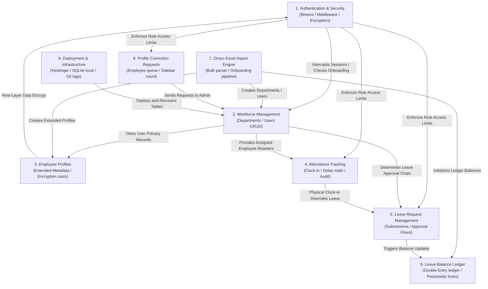

# AMS-V1 — System Architecture Map

This document describes the high-level subsystem relationships, data flow boundaries, and operational dependencies of the Attendance Management System Version 1 (AMS-V1).

---

## 1. Subsystem Interaction Model

The diagram below shows how the 9 major subsystems interact with each other and route their respective data dependencies:

---

## 2. Subsystem Relationships & Data Flows

### Authentication & Security Relationships
* **Authentication → Workforce Management & Dashboards:** 
  * The `CheckPasswordChange` middleware intercepts all incoming requests to workforce and dashboard routes.
  * If the authenticated user has `must_change_password = true`, they are blocked and redirected to the password change view.
* **Authentication → Role-Based Access Control (RBAC):**
  * Controllers map user roles (`admin`, `manager`, `employee`) to restrict query boundaries.
  * Route middleware (`EnsureUserIsAdmin`) restricts import routes, correction queues, and audit dashboards to admin staff.

---

*(Subsystem relationships for other domains will be detailed in respective phase commits)*
