# AMS-V1 — Database Schema & Model Maps

This document records the database schema, model attributes, relations, index structures, and sensitive column designations for AMS-V1.

---

## 1. Schema Diagram

```mermaid
erDiagram
    users {
        bigint id PK
        string employee_id UK "nullable"
        string name
        string email UK
        timestamp email_verified_at "nullable"
        string phone "nullable"
        string password
        enum role "admin, manager, employee"
        enum status "active, inactive, resigned"
        boolean must_change_password "default: true"
        date joining_date "nullable"
        decimal leave_balance "default: 0.00"
        bigint department_id FK "nullable"
        bigint manager_id FK "nullable"
        bigint admin_id FK "nullable"
        string remember_token "nullable"
        timestamp created_at
        timestamp updated_at
    }

    users ||--o| users : "reports_to manager_id / admin_id"
```

---

## 2. Table Definitions

### Table: `users`
Tracks employee login credentials, role assignments, system statuses, and reporting hierarchies.

* **Columns:**
  * `id` (`bigint unsigned`, Primary Key, Auto Increment): Unique identifier.
  * `employee_id` (`varchar(255)`, Unique, Nullable): Standardized employee code (e.g. `EMP00010`).
  * `name` (`varchar(255)`): Employee full name.
  * `email` (`varchar(255)`, Unique): Official corporate email address.
  * `email_verified_at` (`timestamp`, Nullable): Verification timestamp.
  * `phone` (`varchar(255)`, Nullable): Mobile contact number.
  * `password` (`varchar(255)`): BCRYPT-hashed credentials.
  * `role` (`enum('admin', 'manager', 'employee')`, Default: `'employee'`): Functional permission group.
  * `status` (`enum('active', 'inactive', 'resigned')`, Default: `'active'`): Employee lifecycle state.
  * `must_change_password` (`tinyint(1)`, Default: `1`): Flag forcing user to reset password upon login.
  * `joining_date` (`date`, Nullable): Employment start date.
  * `leave_balance` (`decimal(8,2)`, Default: `0.00`): Accrued leave days available.
  * `department_id` (`bigint unsigned`, Nullable, Foreign Key -> `departments.id`): Business unit reference.
  * `manager_id` (`bigint unsigned`, Nullable, Foreign Key -> `users.id`): Reporting manager.
  * `admin_id` (`bigint unsigned`, Nullable, Foreign Key -> `users.id`): HR Administrator reference.
  * `remember_token` (`varchar(100)`, Nullable): Session token.
  * `created_at` / `updated_at` (`timestamp`): Database timestamps.

* **Indexes & Keys:**
  * `PRIMARY KEY (id)`
  * `UNIQUE KEY users_email_unique (email)`
  * `UNIQUE KEY users_employee_id_unique (employee_id)`
  * `FOREIGN KEY users_department_id_foreign (department_id) REFERENCES departments(id) ON DELETE SET NULL`
  * `FOREIGN KEY users_manager_id_foreign (manager_id) REFERENCES users(id) ON DELETE SET NULL`
  * `FOREIGN KEY users_admin_id_foreign (admin_id) REFERENCES users(id) ON DELETE SET NULL`

---

## 3. Sensitive & Encrypted Fields
No sensitive columns are stored directly in the `users` table. Financial and identification keys are isolated in the 1:1 mapped `employee_profiles` table.

---

## 4. Other Subsystem Tables
*(Detailed in respective domain commits)*
