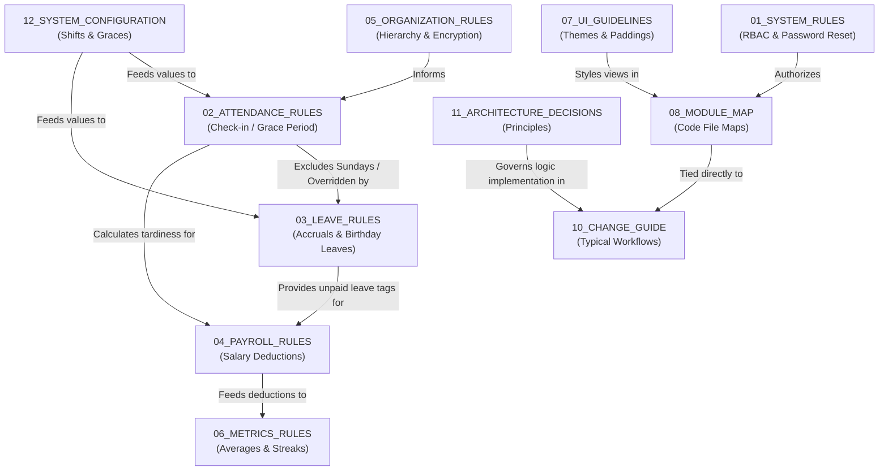

# 00. Project Index & Domain Glossary

This document serves as the master directory, navigation index, and domain glossary for the Attendance Management System Version 1 (AMS-V1) canonical domain documentation.

---

## 1. Domain Directory Map

The documentation is organized into modular files within `docs/domain/`. Each document defines a specific subsystem, its configuration limits, or UI rules.

| Filename | Purpose | Major Domains Covered |
| :--- | :--- | :--- |
| **[00_PROJECT_INDEX.md](file:///c:/Users/Lenovo/AMS-V1/docs/domain/00_PROJECT_INDEX.md)** | Domain dictionary & index. | Master glossary, Document relationship map. |
| **[01_SYSTEM_RULES.md](file:///c:/Users/Lenovo/AMS-V1/docs/domain/01_SYSTEM_RULES.md)** | Security, session, & role rules. | Forced onboarding change password, RBAC permissions, Security encryption. |
| **[02_ATTENDANCE_RULES.md](file:///c:/Users/Lenovo/AMS-V1/docs/domain/02_ATTENDANCE_RULES.md)** | Daily check-in/out & override math. | Late grace periods, Working hour splits, Leave/check-in overrides, Admin corrections. |
| **[03_LEAVE_RULES.md](file:///c:/Users/Lenovo/AMS-V1/docs/domain/03_LEAVE_RULES.md)** | Leave accruals, requests, & ledger accounts. | Planned/Unplanned leaves, Birthday Leave credits, double-entry transactional ledger. |
| **[04_PAYROLL_RULES.md](file:///c:/Users/Lenovo/AMS-V1/docs/domain/04_PAYROLL_RULES.md)** | Linking presence metrics to salary. | Unpaid hours calculation, Unpaid leaves deductions rules, Salary offsets. |
| **[05_ORGANIZATION_RULES.md](file:///c:/Users/Lenovo/AMS-V1/docs/domain/05_ORGANIZATION_RULES.md)** | Relational structures & hierarchy. | Department mappings, reporting manager links, employee profile PII rules. |
| **[06_METRICS_RULES.md](file:///c:/Users/Lenovo/AMS-V1/docs/domain/06_METRICS_RULES.md)** | Performance indicators formulas. | On-time streak counts, attendance rate percentage, average delay calculation. |
| **[07_UI_GUIDELINES.md](file:///c:/Users/Lenovo/AMS-V1/docs/domain/07_UI_GUIDELINES.md)** | Visual standards & layout rules. | Colors, typography, spacing targets, buttons, tables, badges, cards styling. |
| **[08_MODULE_MAP.md](file:///c:/Users/Lenovo/AMS-V1/docs/domain/08_MODULE_MAP.md)** | Codebase file ownership registry. | Paths to Models, Controllers, Services, Tests, and Views per module. |
| **[09_DATA_FLOW.md](file:///c:/Users/Lenovo/AMS-V1/docs/domain/09_DATA_FLOW.md)** | Request lifecycle diagrams. | Sequence of data from Route → Middleware → Controller → Service → Model → DB. |
| **[10_CHANGE_GUIDE.md](file:///c:/Users/Lenovo/AMS-V1/docs/domain/10_CHANGE_GUIDE.md)** | Developer playbooks & change matrix. | Multi-file checklists for modifications, Change Impact Matrix. |
| **[11_ARCHITECTURE_DECISIONS.md](file:///c:/Users/Lenovo/AMS-V1/docs/domain/11_ARCHITECTURE_DECISIONS.md)** | Architecture rationale & coding standards. | Design principles (Services vs Controllers, Overrides on Model, locked balances). |
| **[12_SYSTEM_CONFIGURATION.md](file:///c:/Users/Lenovo/AMS-V1/docs/domain/12_SYSTEM_CONFIGURATION.md)** | Configurable parameters directory. | Default timings, grace limits, monthly accruals, birthday credit windows. |
| **[13_REPORTING_RULES.md](file:///c:/Users/Lenovo/AMS-V1/docs/domain/13_REPORTING_RULES.md)** | Placeholder: Report generation scope. | Reserved for future customized exports. |
| **[14_NOTIFICATION_RULES.md](file:///c:/Users/Lenovo/AMS-V1/docs/domain/14_NOTIFICATION_RULES.md)** | Placeholder: Event alerts system. | Reserved for future email/SMS alerts. |
| **[15_ANALYTICS_RULES.md](file:///c:/Users/Lenovo/AMS-V1/docs/domain/15_ANALYTICS_RULES.md)** | Placeholder: Forecasting metrics. | Reserved for future workforce insight graphs. |
| **[16_INTEGRATION_RULES.md](file:///c:/Users/Lenovo/AMS-V1/docs/domain/16_INTEGRATION_RULES.md)** | Placeholder: External API sync scope. | Reserved for future ERP system links. |
| **[17_API_REFERENCE.md](file:///c:/Users/Lenovo/AMS-V1/docs/domain/17_API_REFERENCE.md)** | Placeholder: Internal/External endpoints. | Reserved for future headless system client endpoints. |
| **[README.md](file:///c:/Users/Lenovo/AMS-V1/docs/domain/README.md)** | Governance & developer workflows. | Rules for updating specifications first, then code/tests/documentation. |

---

## 2. Document Relationships & Cross References

The domain knowledge base acts as a connected graph. Changes in one area cascade to others:

- **[02_ATTENDANCE_RULES.md](file:///c:/Users/Lenovo/AMS-V1/docs/domain/02_ATTENDANCE_RULES.md)** relies on **[12_SYSTEM_CONFIGURATION.md](file:///c:/Users/Lenovo/AMS-V1/docs/domain/12_SYSTEM_CONFIGURATION.md)** to resolve shift times.
- **[03_LEAVE_RULES.md](file:///c:/Users/Lenovo/AMS-V1/docs/domain/03_LEAVE_RULES.md)** defines status values that override attendance status in **[02_ATTENDANCE_RULES.md](file:///c:/Users/Lenovo/AMS-V1/docs/domain/02_ATTENDANCE_RULES.md)**.
- **[04_PAYROLL_RULES.md](file:///c:/Users/Lenovo/AMS-V1/docs/domain/04_PAYROLL_RULES.md)** translates attendance states and leaves into financial metrics.
- **[08_MODULE_MAP.md](file:///c:/Users/Lenovo/AMS-V1/docs/domain/08_MODULE_MAP.md)** provides paths, which are resolved in the **[10_CHANGE_GUIDE.md](file:///c:/Users/Lenovo/AMS-V1/docs/domain/10_CHANGE_GUIDE.md)** matrices.

---

## 3. Domain Terminology Glossary

To prevent translation friction, the following glossary provides clear definitions of common system constructs:

* **Grace Period**: The allowable delay (in minutes) past the shift start time during which an employee is still marked as `present`.
* **Late Arrival**: A status assigned when an employee checks in after the shift start time plus the grace minutes. This automatically classifies the shift as `half_day` with the reason `late_arrival`.
* **Insufficient Hours**: A classification applied during checkout if the time between check-in and check-out is less than 4.0 hours (unless overridden), resulting in a `half_day` with the reason `insufficient_hours`.
* **Rule B (Leave Overrides)**: The business rule where an approved leave request dynamically overrides an employee's absent state. However, a physical check-in overrides the leave request, marking the employee as `present` or `late`.
* **Weekly Off**: Designated non-working days (specifically Sunday). Absent statuses are not assigned on Weekly Offs unless manually overridden.
* **Double-Entry Ledger**: A transactional auditing system for leave balances. All credits (accruals, refunds, manual additions) and debits (deductions) are stored as discrete ledger entries. The user's `leave_balance` represents the cumulative sum.
* **Pessimistic Row Lock (`lockForUpdate`)**: A database transaction lock that blocks concurrent database connections from reading or writing the selected rows (e.g., locking the User record during leave approval) to avoid double-deductions.
* **Birthday Leave Credit**: A complimentary 1.00 day credit allocated dynamically to an eligible employee one day before their date of birth, expiring exactly one year later.
* **Onboarding Change Password**: A security flow where newly created or reset users are marked with `must_change_password = true` and forced to submit a custom password before accessing the system.
* **Two-Pass Import**: The process by which the Import Engine creates departments and users in Pass 1 (saving IDs in an in-memory lookup map), and maps manager-subordinate relationships in Pass 2.
* **Aadhaar / PAN Encryption**: AES-256 standard model encryption applied to sensitive national identity credentials stored in `employee_profiles` at rest.
