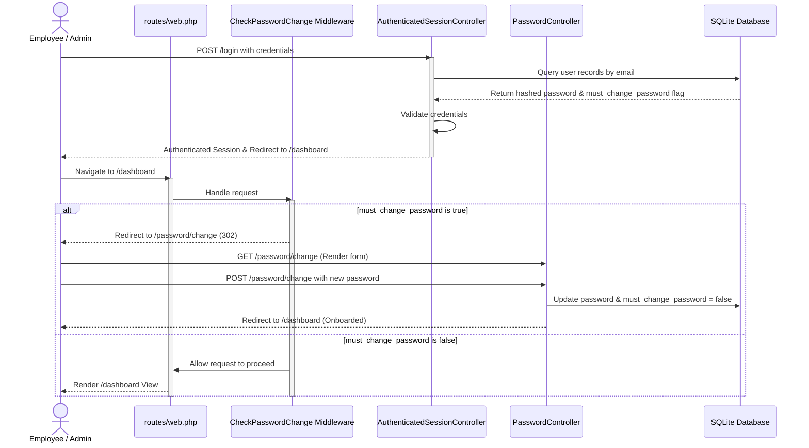
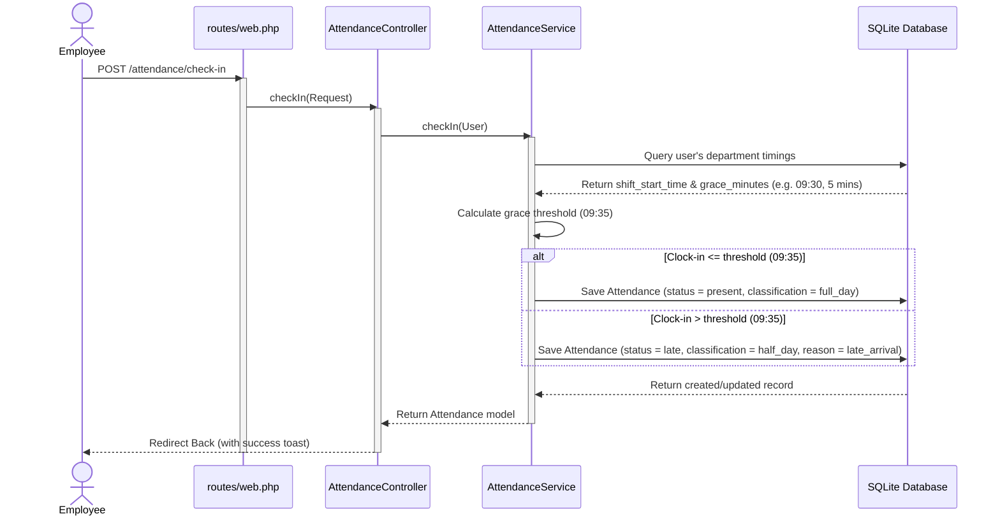
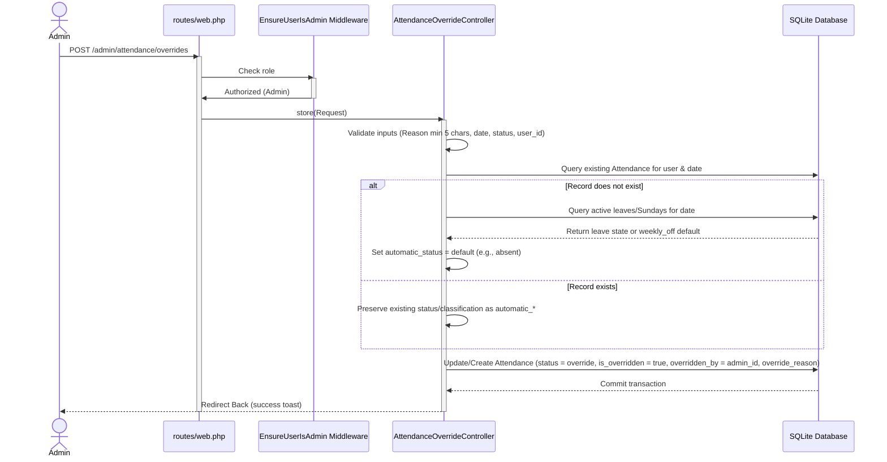
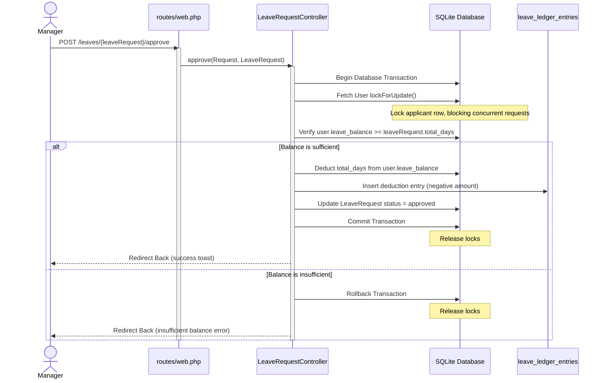
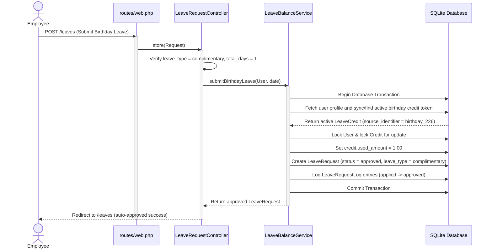
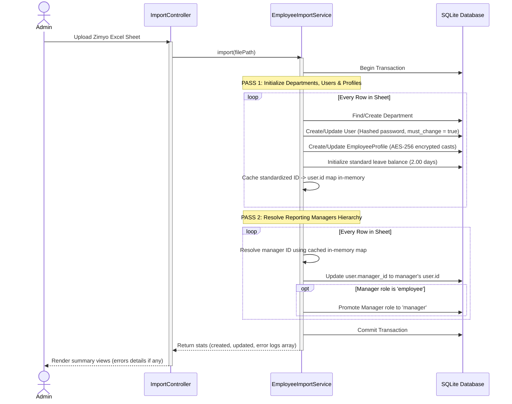

# 09. Data Flow Diagrams

This document illustrates the execution pathways, transaction boundaries, and request lifecycles for major operations in the Attendance Management System.

---

## 1. Login Session & Onboarding Verification

When a user logs in, the request passes through the onboarding middleware to verify password status before loading dashboards.



---

## 2. Attendance Check-in Workflow

Logs employee daily attendance, checks grace thresholds, and sets late arrival half-day classifications.



---

## 3. Administrative Attendance Override

Allows Administrators to manually override status/classifications, enforcing a minimum 5-character reason and preserving the original values as an audit trail.



---

## 4. Leave Request Approval & Balance Ledger

Illustrates the transactional balance update process. It uses database transactions and pessimistic row locks to prevent double-deduction conflicts.



---

## 5. Birthday Leave Credit & Submission

The system automatically verifies eligibility, locks birthday leave credits, and approves the request in a single transaction.



---

## 6. Workforce Excel Uploader (Zimyo Engine)

Bulk parses new users and departments in Pass 1, and maps reporting hierarchies in Pass 2.



---

## 7. Dashboard Loading & Stats Processing

```mermaid
sequenceDiagram
    actor Manager
    participant Controller as DashboardController
    participant Service as AttendanceService
    participant DB as SQLite Database

    Manager->>Controller: GET /dashboard (with filters)
    activate Controller
    Controller->>Service: getTodayStats(date, departmentId, manager)
    activate Service
    
    Service->>DB: Query active employees for manager/department
    DB-->>Service: Return User collection
    
    Service->>DB: Query Attendance records for date & users
    DB-->>Service: Return Attendance records
    
    Service->>DB: Query approved LeaveRequests overlapping date & users
    DB-->>Service: Return LeaveRequests
    
    loop Every Employee
        Service->>Service: Match Attendance and approved Leave Requests
        opt No check-in &approved Leave Request exists
            Service->>Service: Resolve status as 'on_leave' or 'wfh'
        opt No check-in & is Sunday
            Service->>Service: Resolve status as 'weekly_off'
        opt No check-in & no leave/Sunday
            Service->>Service: Resolve status as 'absent'
        end
        Service->>Service: Collate statistics (present, late, absent, averages)
    end
    
    Service-->>Controller: Return stats array
    deactivate Service
    Controller-->>Manager: Render /dashboard page
    deactivate Controller
```
