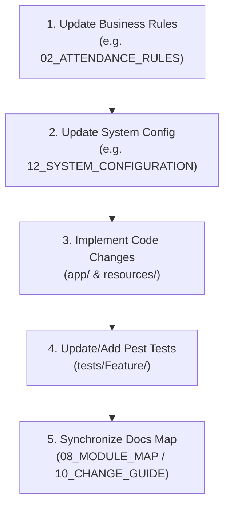

# Workforce Ledger Domain Knowledge Base

This folder serves as the single authoritative source of truth for the business rules, subsystem designs, configurations, and file registries of the Attendance Management System.

---

## 1. Governance & Update Policy

To make future development predictable, modular, and maintainable, all future feature modifications and code updates must follow the **Canonical Documentation Workflow**:

### Critical Rules
- **Documentation First**: Never write code or modify database migrations without first updating the corresponding business rules document inside `docs/domain/`.
- **Zero Discrepancy Tolerance**: If you discover that the codebase implementation behaves differently than the documented business rules, **do not silently accept it**. You must report the discrepancy as an issue or register it in the technical debt list before continuing.
- **Config Separation**: Never hardcode business thresholds or shifts parameters in logic files. Separate configurable constants to `12_SYSTEM_CONFIGURATION.md` and Laravel config containers.

---

## 2. Directory Navigation

Refer to **[00_PROJECT_INDEX.md](file:///c:/Users/Lenovo/AMS-V1/docs/domain/00_PROJECT_INDEX.md)** for a master directory, a terminology glossary, and document cross-reference mappings.
