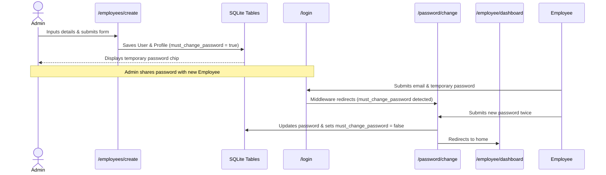
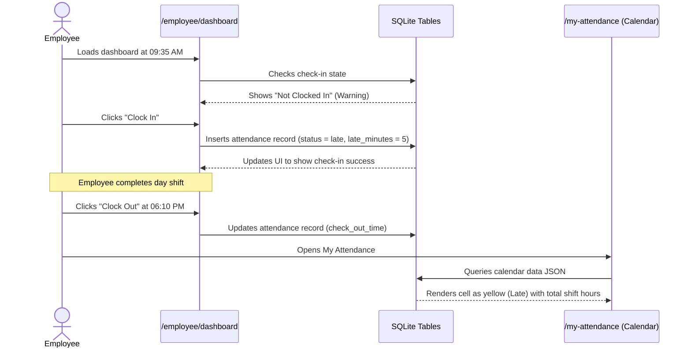
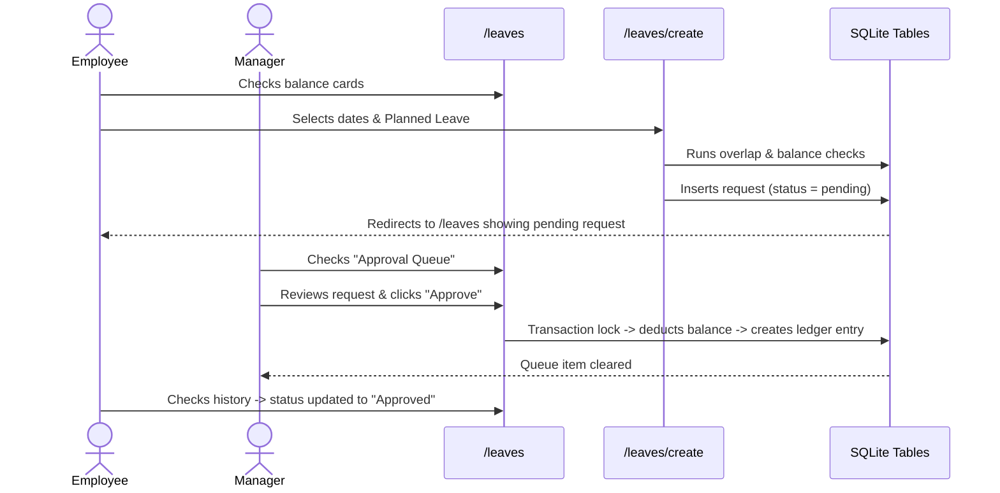
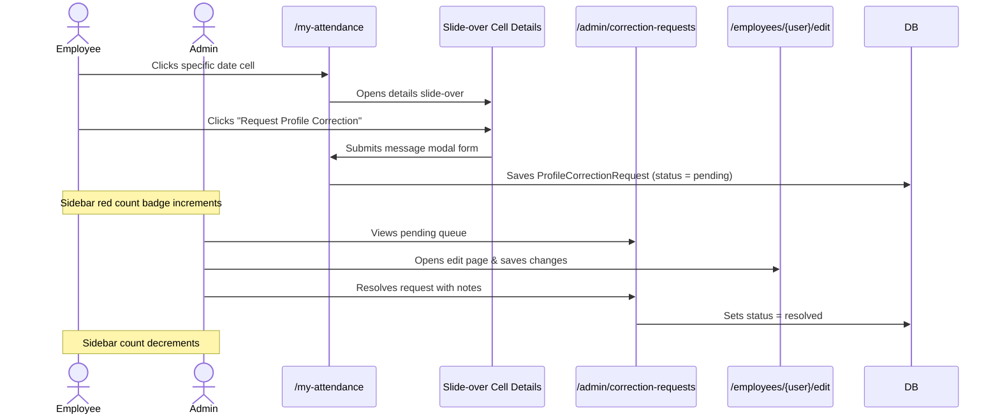
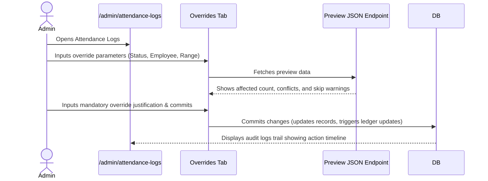

# Sidebar Information Architecture Audit
This document outlines the complete information architecture, routing registry, feature maps, user workflows, screen relationships, and role-based permissions of the Attendance Management System (AMS-V1). 

---

## 1. Sidebar Item Directory (Current Implementation)

The system currently exposes up to 8 top-level navigation links in [sidebar.blade.php](file:///c:/Users/Lenovo/AMS-V1/resources/views/components/sidebar.blade.php). Each item is detailed below:

### 1. Dashboard
* **Display Name:** `Dashboard`
* **Route:** Dynamic based on role:
  * Employee: `employee.dashboard` (mapped to `/employee/dashboard`)
  * Admin / Manager: `dashboard` (mapped to `/dashboard`)
* **Controller:** 
  * Employee: [AttendanceController@employeeDashboard](file:///c:/Users/Lenovo/AMS-V1/app/Http/Controllers/AttendanceController.php#L20-L184)
  * Admin / Manager: [DashboardController@index](file:///c:/Users/Lenovo/AMS-V1/app/Http/Controllers/DashboardController.php#L19-L63)
* **View:**
  * Employee: `resources/views/attendance/employee-dashboard.blade.php`
  * Admin / Manager: `resources/views/dashboard.blade.php`
* **Purpose:** Serves as the landing hub. Displays real-time metrics, active clock tickers, shift details, quick action clock buttons, and recent logs feed.
* **Primary User Roles:** All (Employee, Manager, Admin).
* **Frequency of Use:** Very High (loaded on every login and session return).
* **Parent Feature:** Core Dashboard Subsystem.
* **Related Features:** Punctuality metrics, Check-in/out triggers, profile correction triggers.
* **Dependencies:** `AttendanceService` (metrics computations), `users` reporting hierarchy.
* **Child Pages:** None.
* **Secondary Navigation:** On Employee Dashboard: click targets redirect to profile verification or calendar. On Manager/Admin Dashboard: header filter form with `date`, `department_id`, and `search` query parameters.
* **Actions Available:**
  * Employee: Clock In, Clock Out, Request Correction (Modal).
  * Manager/Admin: Filter attendance roster by Department/Date, Search employees by Name/ID.
* **Typical Workflow:** User authenticates -> Redirects to Dashboard -> Employee checks clock state and clicks "Clock In" -> Manager reviews overall daily present/absent counts.

---

### 2. Attendance Logs (Admin Only)
* **Display Name:** `Attendance Logs`
* **Route:** `admin.attendance.logs` (mapped to `/admin/attendance-logs`)
* **Controller:** [AttendanceAuditController@index](file:///c:/Users/Lenovo/AMS-V1/app/Http/Controllers/AttendanceAuditController.php#L18-L138)
* **View:** `resources/views/admin/attendance-logs.blade.php`
* **Purpose:** Audit ledger for daily attendance logs, managing manual overrides, and viewing the timeline logs of historical overrides.
* **Primary User Roles:** Admin.
* **Frequency of Use:** High.
* **Parent Feature:** Attendance Tracking & Auditing Subsystem.
* **Related Features:** Attendance Overrides, Workforce Directory.
* **Dependencies:** `Attendance` model, `AttendanceService` (roster generation).
* **Child Pages:** Individual Employee Attendance Show page (`/admin/attendance/employee/{user}`).
* **Secondary Navigation:** In-page tabs:
  1. *Daily Roster:* Roster filter list.
  2. *Manual Overrides:* Individual/bulk override config panel.
  3. *Audit Trail:* Historical override actions timeline.
* **Actions Available:** Filter roster by date/status/department/search, Trigger individual/bulk override, Preview override conflicts, View override metadata.
* **Typical Workflow:** Admin selects target date and department -> Notes missing check-out for employee -> Launches Override modal -> Inputs replacement status, classification, and mandatory justification -> Submits -> System stores pre-override state and writes audit trace.

---

### 3. My Attendance
* **Display Name:** `My Attendance`
* **Route:** `attendance.my-attendance` (mapped to `/my-attendance`)
* **Controller:** [AttendanceController@myAttendance](file:///c:/Users/Lenovo/AMS-V1/app/Http/Controllers/AttendanceController.php#L189-L270)
* **View:** `resources/views/attendance/my-attendance.blade.php`
* **Purpose:** Displays an employee's personal attendance cards, 30-day tabular history, and interactive month-to-month calendar.
* **Primary User Roles:** All (Employee, Manager, Admin can view their own history).
* **Frequency of Use:** High.
* **Parent Feature:** Attendance Tracking Subsystem.
* **Related Features:** Profile Correction requests, Monthly accrual calculations.
* **Dependencies:** `EmployeeAttendanceCalendarController` (serves grid cells JSON data).
* **Child Pages:** Complete history index page (`/attendance/history`).
* **Secondary Navigation:** Calendar tab vs. Ledger table tab.
* **Actions Available:** Month navigation, Click date cells to trigger detailed slide-over info (check-in/out time, device, geo-coordinates, late minutes, early exit, grace boundaries, notes, correction link).
* **Typical Workflow:** Employee wants to check if a late check-in applied to a certain day -> Navigates to My Attendance -> Scrolls to date -> Clicks cell -> Reads metadata and clicks "Request Profile Correction" to fix errors.

---

### 4. Workforce
* **Display Name:** `Workforce`
* **Route:** `employees.index` (mapped to `/employees`)
* **Controller:** [EmployeeController@index](file:///c:/Users/Lenovo/AMS-V1/app/Http/Controllers/EmployeeController.php#L25-L80)
* **View:** `resources/views/employees/index.blade.php`
* **Purpose:** Central personnel directory mapping organizational structures and reporting assignments.
* **Primary User Roles:** Admin, Manager (Manager views direct reports only).
* **Frequency of Use:** High (HR Operations).
* **Parent Feature:** Workforce Directory Subsystem.
* **Related Features:** Employee Profiles (encrypted fields), Password Resets, Excel Imports.
* **Dependencies:** `User` model, `Department` model, `EmployeeService`.
* **Child Pages:**
  * Create Employee: `employees.create` (mapped to `/employees/create`)
  * Show Employee: `employees.show` (mapped to `/employees/{user}`)
  * Edit Employee: `employees.edit` (mapped to `/employees/{user}/edit`)
* **Secondary Navigation:** Filters: Search input, Department dropdown, Manager dropdown, Sort fields (Name, ID, Email, Status, Date).
* **Actions Available:** Create new worker, Edit profile tabs, Reset password to default (Admin only), Delete worker (Admin anywhere; Manager direct reports only).
* **Typical Workflow:** HR recruits a candidate -> Opens Workforce -> Clicks "Add Member" -> Submits core fields and encrypted details (Aadhaar, PAN, Bank) -> Account is provisioned with a default password and onboarding security flag.

---

### 5. Departments
* **Display Name:** `Departments`
* **Route:** `departments.index` (mapped to `/departments`)
* **Controller:** [DepartmentController@index](file:///c:/Users/Lenovo/AMS-V1/app/Http/Controllers/DepartmentController.php)
* **View:** `resources/views/departments/index.blade.php`
* **Purpose:** Manages company departments, codes, descriptions, default shifts, and late buffer thresholds.
* **Primary User Roles:** Admin, Manager.
* **Frequency of Use:** Low (Administrative Setup).
* **Parent Feature:** Department Configuration.
* **Related Features:** Roster filters, Attendance delay math.
* **Dependencies:** `Department` model.
* **Child Pages:**
  * Create Department: `departments.create` (mapped to `/departments/create`)
  * Show Department: `departments.show` (mapped to `/departments/{department}`)
  * Edit Department: `departments.edit` (mapped to `/departments/{department}/edit`)
* **Secondary Navigation:** None.
* **Actions Available:** Create new department, Edit name/code/shift times/grace periods, Delete department.
* **Typical Workflow:** Admin configures shift rules -> Creates "Engineering" -> Sets start to `09:30`, end to `18:00`, grace buffer to `15` -> Saves. Employees assigned to Engineering inherit these timings.

---

### 6. Leaves
* **Display Name:** `Leaves`
* **Route:** `leaves.index` (mapped to `/leaves`)
* **Controller:** [LeaveRequestController@index](file:///c:/Users/Lenovo/AMS-V1/app/Http/Controllers/LeaveRequestController.php#L22-L87)
* **View:** `resources/views/leaves/index.blade.php`
* **Purpose:** Central workspace for submitting personal leaves, viewing ledger balances, and processing approval queues.
* **Primary User Roles:** All (Employees request; Managers/Admins resolve).
* **Frequency of Use:** High.
* **Parent Feature:** Leave Request Subsystem.
* **Related Features:** Double-entry ledger balance, Birthday credits check.
* **Dependencies:** `LeaveRequest` model, `LeaveLedgerEntry` model, `LeaveCredit` model.
* **Child Pages:**
  * Create Leave: `leaves.create` (mapped to `/leaves/create`)
  * Show Leave: `leaves.show` (mapped to `/leaves/{leaveRequest}`)
* **Secondary Navigation:** Tabs inside manager/admin panels (My Requests, Approval Queue, History Logs).
* **Actions Available:** Apply for leaves (Planned/Unplanned/Birthday), Cancel request, Approve request, Reject request with reasons, Admin override.
* **Typical Workflow:** Employee submits a 3-day Planned Leave -> System runs overlap validation -> Enters pending status -> Manager opens Leaves page -> Opens Approval Queue -> Reviews request -> Clicks Approve -> Balance is decremented from employee, ledger entry written.

---

### 7. Import Employees (Admin Only)
* **Display Name:** `Import Employees`
* **Route:** `admin.import.show` (mapped to `/admin/import-employees`)
* **Controller:** [ImportController@showUploadForm](file:///c:/Users/Lenovo/AMS-V1/app/Http/Controllers/ImportController.php#L20-L28)
* **View:** `resources/views/admin/import-employees.blade.php`
* **Purpose:** Provision workforce rosters in bulk using Zimyo Excel exports.
* **Primary User Roles:** Admin.
* **Frequency of Use:** Low.
* **Parent Feature:** Bulk Import Engine.
* **Related Features:** Workforce Directory, Ledger Initializations.
* **Dependencies:** `ImportLog` model, `EmployeeImportService`.
* **Child Pages:** None.
* **Secondary Navigation:** Bottom history timeline table showing logs.
* **Actions Available:** Upload CSV/XLSX/TXT spreadsheets, view warnings, inspect history.
* **Typical Workflow:** Admin receives employee sheet -> Navigates to Import Employees -> Selects spreadsheet -> Submits -> System executes Pass 1 (records creation & profile casts) and Pass 2 (hierarchical reporting link commits) -> Displays processed rows and skipped warnings.

---

### 8. Correction Requests (Admin Only)
* **Display Name:** `Correction Requests`
* **Route:** `admin.corrections.index` (mapped to `/admin/correction-requests`)
* **Controller:** [ProfileCorrectionRequestController@adminIndex](file:///c:/Users/Lenovo/AMS-V1/app/Http/Controllers/ProfileCorrectionRequestController.php#L71-L84)
* **View:** `resources/views/admin/correction-requests/index.blade.php`
* **Purpose:** Interactive queue for reviewing and resolving employee profile correction claims.
* **Primary User Roles:** Admin.
* **Frequency of Use:** Medium.
* **Parent Feature:** Correction Requests Subsystem.
* **Related Features:** User profiles update, Sidebar notification badge count.
* **Dependencies:** `ProfileCorrectionRequest` model.
* **Child Pages:** None.
* **Secondary Navigation:** Red badge counter on sidebar listing pending requests.
* **Actions Available:** View details, Mark resolved, Add admin notes.
* **Typical Workflow:** Employee submits request to fix bank IFSC code -> Red badge updates for Admin -> Admin opens Correction Requests -> Reviews claim -> Manually updates detail under Workforce -> Enters resolution notes -> Submits -> Request status resolves.

---

## 2. Role-Based Navigation Matrix

The system dynamically renders sidebar segments and restricts route boundaries using user roles. Below is the comprehensive role-based access matrix:

| Sidebar Navigation Item | Route | Employee Role | Manager Role | Admin Role | Permission Checks & RBAC Logic |
| :--- | :--- | :---: | :---: | :---: | :--- |
| **Dashboard** | `dashboard` or `employee.dashboard` | **Visible** | **Visible** | **Visible** | If role is `employee`, `/dashboard` redirects to `/employee/dashboard`. Employees cannot load `/dashboard`. |
| **Attendance Logs** | `admin.attendance.logs` | Hidden | Hidden | **Visible** | Enforced by `EnsureUserIsAdmin` middleware on routes starting with `/admin/`. Checks `$user->role === 'admin'`. |
| **My Attendance** | `attendance.my-attendance` | **Visible** | **Visible** | **Visible** | Accessible by all. Returns records scoped strictly to the authenticated user session. |
| **Workforce** | `employees.index` | Hidden | **Visible** | **Visible** | Checks `role !== 'employee'`. Managers see only employees reporting to them via `manager_id`. Admins see everyone. |
| **Departments** | `departments.index` | Hidden | **Visible** | **Visible** | Checks `role !== 'employee'`. Employees hitting `/departments` trigger a `403 Forbidden` exception. |
| **Leaves** | `leaves.index` | **Visible** | **Visible** | **Visible** | Shared view. Dashboard lists personal leaves. If Manager, shows queue for reports. If Admin, shows company-wide queue. |
| **Import Employees** | `admin.import.show` | Hidden | Hidden | **Visible** | Restrictive `EnsureUserIsAdmin` middleware block. Checks `$user->role === 'admin'`. |
| **Correction Requests** | `admin.corrections.index` | Hidden | Hidden | **Visible** | Restricted to `admin` role. Sidebar count query: `\App\Models\ProfileCorrectionRequest::where('status', 'pending')->count()`. |

---

## 3. Comprehensive Route Inventory

Below is the complete route registry mapped by functional domain module, including verb, path, controller handler, name, and middleware protection blocks:

### Module 1: Session, Authentication & Onboarding
* `GET` | `/login` | `Auth\AuthenticatedSessionController@create` | `login` | `guest`
* `POST` | `/login` | `Auth\AuthenticatedSessionController@store` | — | `guest`
* `GET` | `/forgot-password` | `Auth\PasswordResetLinkController@create` | `password.request` | `guest`
* `POST` | `/forgot-password` | `Auth\PasswordResetLinkController@store` | `password.email` | `guest`
* `GET` | `/reset-password/{token}` | `Auth\NewPasswordController@create` | `password.reset` | `guest`
* `POST` | `/reset-password` | `Auth\NewPasswordController@store` | `password.store` | `guest`
* `GET` | `/verify-email` | `Auth\EmailVerificationPromptController` | `verification.notice` | `auth`
* `GET` | `/verify-email/{id}/{hash}` | `Auth\VerifyEmailController` | `verification.verify` | `auth`, `signed`, `throttle:6,1`
* `POST` | `/email/verification-notification` | `Auth\EmailVerificationNotificationController@store` | `verification.send` | `auth`, `throttle:6,1`
* `GET` | `/confirm-password` | `Auth\ConfirmablePasswordController@show` | `password.confirm` | `auth`
* `POST` | `/confirm-password` | `Auth\ConfirmablePasswordController@store` | — | `auth`
* `PUT` | `/password` | `Auth\PasswordController@update` | `password.update` | `auth`
* `GET` | `/password/change` | `Auth\PasswordController@showChange` | `password.change` | `auth`
* `POST` | `/password/change` | `Auth\PasswordController@storeChange` | `password.change.update` | `auth`
* `POST` | `/logout` | `Auth\AuthenticatedSessionController@destroy` | `logout` | `auth`

### Module 2: Workforce Directory & Department Operations
* `GET` | `/profile` | `ProfileController@edit` | `profile.edit` | `auth`
* `PATCH` | `/profile` | `ProfileController@update` | `profile.update` | `auth`
* `DELETE` | `/profile` | `ProfileController@destroy` | `profile.destroy` | `auth`
* `GET` | `/departments` | `DepartmentController@index` | `departments.index` | `auth`
* `GET` | `/departments/create` | `DepartmentController@create` | `departments.create` | `auth`
* `POST` | `/departments` | `DepartmentController@store` | `departments.store` | `auth`
* `GET` | `/departments/{department}` | `DepartmentController@show` | `departments.show` | `auth`
* `GET` | `/departments/{department}/edit` | `DepartmentController@edit` | `departments.edit` | `auth`
* `PUT` | `/departments/{department}` | `DepartmentController@update` | `departments.update` | `auth`
* `DELETE` | `/departments/{department}` | `DepartmentController@destroy` | `departments.destroy` | `auth`
* `GET` | `/employees` | `EmployeeController@index` | `employees.index` | `auth`
* `GET` | `/employees/create` | `EmployeeController@create` | `employees.create` | `auth`
* `POST` | `/employees` | `EmployeeController@store` | `employees.store` | `auth`
* `GET` | `/employees/{user}` | `EmployeeController@show` | `employees.show` | `auth`
* `GET` | `/employees/{user}/edit` | `EmployeeController@edit` | `employees.edit` | `auth`
* `PUT` | `/employees/{user}` | `EmployeeController@update` | `employees.update` | `auth`
* `DELETE` | `/employees/{user}` | `EmployeeController@destroy` | `employees.destroy` | `auth`
* `POST` | `/admin/employees/{user}/reset-password` | `EmployeeController@resetPassword` | `admin.employees.reset-password` | `auth`, `admin`

### Module 3: Attendance Logs, Overrides & Timings
* `GET` | `/dashboard` | `DashboardController@index` | `dashboard` | `auth`, `verified`
* `GET` | `/employee/dashboard` | `AttendanceController@employeeDashboard` | `employee.dashboard` | `auth`
* `GET` | `/my-attendance` | `AttendanceController@myAttendance` | `attendance.my-attendance` | `auth`
* `GET` | `/attendance/calendar/data` | `EmployeeAttendanceCalendarController@getData` | `attendance.calendar.data` | `auth`
* `POST` | `/attendance/check-in` | `AttendanceController@checkIn` | `attendance.check-in` | `auth`
* `POST` | `/attendance/check-out` | `AttendanceController@checkOut` | `attendance.check-out` | `auth`
* `GET` | `/attendance/history` | `AttendanceController@history` | `attendance.history` | `auth`
* `GET` | `/admin/attendance/employee/{user}` | `ManagerAttendanceController@show` | `admin.attendance.employee.show` | `auth`
* `GET` | `/admin/attendance-logs` | `AttendanceAuditController@index` | `admin.attendance.logs` | `auth`, `admin`
* `GET` | `/admin/attendance/overrides/employees` | `AttendanceOverrideController@employees` | `admin.attendance.override.employees` | `auth`, `admin`
* `POST` | `/admin/attendance/overrides/preview` | `AttendanceOverrideController@preview` | `admin.attendance.override.preview` | `auth`, `admin`
* `POST` | `/admin/attendance/overrides` | `AttendanceOverrideController@store` | `admin.attendance.override.store` | `auth`, `admin`

### Module 4: Leaves Lifecycle & Accrual Registers
* `GET` | `/leaves` | `LeaveRequestController@index` | `leaves.index` | `auth`
* `GET` | `/leaves/create` | `LeaveRequestController@create` | `leaves.create` | `auth`
* `POST` | `/leaves` | `LeaveRequestController@store` | `leaves.store` | `auth`
* `GET` | `/leaves/{leaveRequest}` | `LeaveRequestController@show` | `leaves.show` | `auth`
* `POST` | `/leaves/{leaveRequest}/cancel` | `LeaveRequestController@cancel` | `leaves.cancel` | `auth`
* `POST` | `/leaves/{leaveRequest}/approve` | `LeaveRequestController@approve` | `leaves.approve` | `auth`
* `POST` | `/leaves/{leaveRequest}/reject` | `LeaveRequestController@reject` | `leaves.reject` | `auth`
* `POST` | `/leaves/{leaveRequest}/override` | `LeaveRequestController@override` | `leaves.override` | `auth`

### Module 5: Imports & Profile Corrections
* `GET` | `/admin/import-employees` | `ImportController@showUploadForm` | `admin.import.show` | `auth`, `admin`
* `POST` | `/admin/import-employees` | `ImportController@handleUpload` | `admin.import.handle` | `auth`, `admin`
* `POST` | `/employee/correction-requests` | `ProfileCorrectionRequestController@store` | `employee.corrections.store` | `auth`
* `GET` | `/admin/correction-requests` | `ProfileCorrectionRequestController@adminIndex` | `admin.corrections.index` | `auth`, `admin`
* `POST` | `/admin/correction-requests/{correctionRequest}/resolve` | `ProfileCorrectionRequestController@adminResolve` | `admin.corrections.resolve` | `auth`, `admin`

---

## 4. Comprehensive Feature Map

The Attendance Management System's primary business components are structured as follows:

### 1. Attendance Verification Engine
* **Purpose:** Manages clock events, computes delayed arrival math against flexible boundaries, checks weekend parameters, and calculates overall hours.
* **Entry Point:** Employee Dashboard `/employee/dashboard` or My Attendance `/my-attendance`.
* **Subpages:** Calendar Data Endpoints `/attendance/calendar/data`, History Index `/attendance/history`.
* **Dependencies:** `Attendance` table, `AttendanceTimingResolver` utility, `AttendanceService`.
* **Business Workflow:** Employee hits "Clock In" -> System writes `check_in_time` timestamp -> If check-in time exceeds department grace threshold (e.g. 09:30 + 15m), entry marks as `late`. Checks Sunday bounds. Employee checks out -> Writes `check_out_time` -> Computes total elapsed work hours.
* **Relationships:** Feeds daily metrics into `DashboardController`. Intercepted by approved `LeaveRequest` days to mark states as `on_leave`/`wfh` when no check-in is present.
* **Importance:** Critical (Core Operational Component).
* **Expected Frequency of Use:** Very High.

### 2. Manual Overrides Console (Admin Only)
* **Purpose:** Corrects database irregularities by individual/bulk state overwrites, providing conflict warnings and balance rollback synchronization.
* **Entry Point:** Attendance Logs -> Manual Overrides tab.
* **Subpages:** Autocomplete Endpoint `/admin/attendance/overrides/employees`, Preview conflicts `/admin/attendance/overrides/preview`.
* **Dependencies:** `AttendanceService@applyBulkOverride`, `Attendance` model, `LeaveRequest` refund controllers.
* **Business Workflow:** Admin selects scope (Individual, Department, All) -> Fills dates (Single, Range, Multiple) -> Selects desired override state -> Enters mandatory justification (>= 5 chars) -> System runs preview scan to detect overlaps -> Admin commits -> Database updates records and performs leave balance updates if shifting a day's classification.
* **Relationships:** Directly edits `attendances` table rows. Logs timeline records in `AttendanceAuditController`. Triggers ledger refunds/deductions via `LeaveBalanceService` when changing status to/from leave states.
* **Importance:** High (Operational Auditing).
* **Expected Frequency of Use:** Medium.

### 3. Leave Request Lifecycle
* **Purpose:** Manages time-off requests, executes overlap validation, runs manager approval chains, and deducts or refunds leave balances.
* **Entry Point:** Leaves page `/leaves`.
* **Subpages:** Apply Leave `/leaves/create`, Show Details `/leaves/{leaveRequest}`.
* **Dependencies:** `LeaveRequest` model, `LeaveLedgerEntry` double-entry model, `LeaveCredit` system.
* **Business Workflow:** Employee submits dates and reason -> System validates date range overlap -> Request enters `pending`. Manager reviews direct reports -> Approves -> Transaction locks the user row, deducts days from `leave_balance`, and writes a `deduction` ledger line. Auto-approves Birthday Leaves or requests made by Admins.
* **Relationships:** Alters `users.leave_balance` dynamically. Updates resolved daily calendar statuses on My Attendance pages.
* **Importance:** High (Core Personnel Component).
* **Expected Frequency of Use:** High.

### 4. Workforce & Employee Profiles
* **Purpose:** Handles employee accounts, department mappings, corporate roles, and bank/personal identifiers, utilizing AES-256 model encryptions for privacy.
* **Entry Point:** Workforce page `/employees`.
* **Subpages:** Add User `/employees/create`, Details Dossier `/employees/{user}`, Edit Profile `/employees/{user}/edit`.
* **Dependencies:** `User` model, `EmployeeProfile` model, Laravel cipher cast registers.
* **Business Workflow:** HR adds user -> Profile setup auto-creates 1:1 linked dossier row -> Sensitive inputs (Aadhaar, PAN, Bank) are encrypted on save -> On deletion, database constraints cascade-delete the profile.
* **Relationships:** Dictates manager-employee reporting chains. Department assignments link to default shifts. Profile updates can be requested by employees via Correction Requests.
* **Importance:** High (Personnel Infrastructure).
* **Expected Frequency of Use:** Medium.

### 5. Zimyo Provisioning Engine (Admin Only)
* **Purpose:** Imports spreadsheets in bulk, registers accounts, maps organizational chains, and hooks opening ledger balances.
* **Entry Point:** Import Employees page `/admin/import-employees`.
* **Subpages:** None.
* **Dependencies:** `ImportLog` history model, local Storage disc, `EmployeeImportService`.
* **Business Workflow:** Admin posts Zimyo file -> Pass 1 records users, profiles, and opening balance (2.00 leaves) -> Pass 2 resolves reporting managers -> History registers metrics.
* **Relationships:** Populates Workforce directory and department tables.
* **Importance:** Medium (Onboarding).
* **Expected Frequency of Use:** Low.

### 6. Profile Correction Queue (Admin Only)
* **Purpose:** Coordinates employee correction requests, displaying an HR review queue and matching notification sidebar counts.
* **Entry Point:** Correction Requests page `/admin/correction-requests`.
* **Subpages:** Store Request `/employee/correction-requests` (Endpoint).
* **Dependencies:** `ProfileCorrectionRequest` model.
* **Business Workflow:** Employee submits corrections (e.g. Phone, Bank) -> Sidebar count increments -> Admin reviews -> Edits Workforce -> Resolves request -> Sidebar count decrements.
* **Relationships:** Employees trigger requests from the My Attendance calendar detail drawer.
* **Importance:** Medium (Operational Support).
* **Expected Frequency of Use:** Medium.

---

## 5. Workflow Mapping

This section diagrams the step-by-step screen navigation and database states for key application processes:

### 1. Employee Onboarding & Security Cycle


### 2. Daily Attendance & Verification Flow


### 3. Leave Request & Balance Verification


### 4. Profile Correction Request Flow


### 5. Attendance Override Workflow


---

## 6. Navigation Hierarchy Analysis

The application's interfaces are structured into distinct layout levels:

### 1. Primary Navigation (Sidebar Controls)
* Persistent navigation panel ([sidebar.blade.php](file:///c:/Users/Lenovo/AMS-V1/resources/views/components/sidebar.blade.php)).
* Contains logo crest, main links with active visual states (highlighted text, borders), profile avatar details, and the logout trigger.
* Actions: Navigates between primary functional models.

### 2. Secondary Navigation (In-Page Layout Controls)
* Segmented control tabs or filtering forms inside views:
  * *Attendance Logs:* Tab navigation (Daily Roster, Manual Overrides, Audit Trail).
  * *My Attendance:* Tab layout switching (Interactive Calendar, History list).
  * *Leaves:* Multi-column tables (Personal Request lists, Team Approval Queue, Approval History logs).

### 3. Contextual Navigation (Action Targets)
* **Calendar Details Drawer:** Clicks on calendar cells trigger a slide-out details pane instead of navigating away.
* **Workforce List Action Icons:** "View Details" (eye icon) and "Edit Profile" (pencil icon) on list rows.
* **Leaves List Show Link:** Click targets on specific leave requests.

### 4. Modal-Driven Navigation (Overlay Actions)
* **Leave Approval/Rejection Modal:** Pop-up window requesting justifications before committing.
* **Profile Correction Form Modal:** Pop-up on the calendar detail drawer.
* **Reset Password Confirm Modal:** Admin verification popup.

### 5. Detail Pages
* [employees.show](file:///c:/Users/Lenovo/AMS-V1/resources/views/employees/show.blade.php): Detailed profile tabs (General, Work details, Compensation details, Bank info, Documents).
* [leaves.show](file:///c:/Users/Lenovo/AMS-V1/resources/views/leaves/show.blade.php): Tracks approval logs, workflow history, and notes.
* [attendance.show](file:///c:/Users/Lenovo/AMS-V1/resources/views/attendance/show.blade.php): A manager's view of an employee's personal attendance calendar.

### 6. Standalone & Configuration Pages
* **Standalone Pages:** `/password/change` (password onboarding screen), `/profile` (profile settings page).
* **Configuration Pages:** `/departments` index, create, and edit forms.

---

## 7. Screen Relationship Tree

The complete screen hierarchy mapping parent-child navigation flows is detailed below:

```
Dashboard (Admin / Manager) [dashboard]
├── Workforce Directory [/employees]
│   ├── Add Employee [/employees/create]
│   ├── Employee Details [/employees/{user}] (Tabs: Profile, Address, Bank, Emergency)
│   └── Edit Employee [/employees/{user}/edit]
├── Department Directory [/departments]
│   ├── Create Department [/departments/create]
│   ├── Department Details [/departments/{department}]
│   └── Edit Department [/departments/{department}/edit]
├── Leaves Dashboard [/leaves]
│   ├── Submit Leave Form [/leaves/create]
│   └── Leave Details View [/leaves/{leaveRequest}]
├── Attendance Logs & Overrides [/admin/attendance-logs]
│   ├── Employee Attendance Details [/admin/attendance/employee/{user}]
│   └── Override Conflict Preview (API)
├── Import Employees Portal [/admin/import-employees]
└── Correction Requests Queue [/admin/correction-requests]

Dashboard (Employee) [employee.dashboard]
├── My Attendance Panel [/my-attendance]
│   ├── Attendance Details Drawer (Slide-out panel)
│   │   └── Submit Profile Correction Request (Modal overlay)
│   └── Personal History List [/attendance/history]
├── Leaves Workspace [/leaves]
│   ├── Apply Leave Form [/leaves/create]
│   └── Leave Details [/leaves/{leaveRequest}]
└── Profile Settings [/profile]
```

---

## 8. Navigation Heat & Placement Analysis

The estimated usage frequency for each screen dictates its optimal placement in a redesigned navigation hierarchy:

| Page / Subpage | Expected Usage | Target User | Current Placement | Recommended Placement |
| :--- | :--- | :--- | :--- | :--- |
| **Clock-In / Out Actions** | Very High | All Employees | Home Dashboard | Main persistent action (Header or floating overlay). |
| **Personal Attendance Calendar** | High | All Employees | My Attendance Sidebar | Primary Sidebar (rename to "My Calendar" or "Attendance Tracker"). |
| **Leave Application Form** | High | All Employees | Leaves -> Apply | Secondary button on Leaves home or quick header action. |
| **Pending Leaves Approval Queue** | High | Managers / Admins | Leaves -> Approval Queue | Dedicated team management section on primary sidebar. |
| **Workforce Directory** | High | Managers / Admins | Workforce Sidebar | Primary Sidebar (grouped under "Workforce Management"). |
| **Daily Attendance Roster** | High | Managers / Admins | Attendance Logs Sidebar | Grouped under "Workforce Management" or team section. |
| **Correction Requests Queue** | Medium | Admins | Correction Requests Sidebar | Sub-page of Admin Tools or notifications dropdown. |
| **Individual Overrides Tab** | Medium | Admins | Attendance Logs Sidebar | Contextual actions directly inside the Roster table. |
| **Profile Settings** | Medium | All | Footer profile block | Header profile menu dropdown (avoids sidebar clutter). |
| **Import Portal** | Low | Admins | Import Employees Sidebar | Grouped under "Admin Console" or expandable settings menu. |
| **Department Settings** | Low | Admins | Departments Sidebar | Grouped under "System Settings" or expandable settings menu. |

---

## 9. Current Sidebar Audit & IA Recommendations

An audit of the current [sidebar.blade.php](file:///c:/Users/Lenovo/AMS-V1/resources/views/components/sidebar.blade.php) structure reveals several limitations:

### 1. Architectural & Usability Limitations
1. **Flat Hierarchy (No Grouping):** Administrative configurations (Departments), operational workflows (Workforce, Attendance Logs), and personal actions (My Attendance, Leaves) are mixed in a flat list. This increases cognitive load.
2. **Workflow Interruptions (Lack of Deep Linking):**
   * **Corrections Workflow:** When an Admin reviews a correction request, they must exit, navigate to Workforce, search for the employee, open edit mode, and apply changes. There is no direct "Apply Correction" link.
   * **Roster Workflow:** When a Manager views a roster discrepancy in Attendance Logs, they must search for the employee in Workforce to check their reporting details.
3. **Role-Based Visual Clutter:** A Manager sees "Workforce" and "Departments" next to "My Attendance" without any structural separation between *Self* and *Team* contexts.
4. **Scattered Action Items:** "Import Employees" and "Correction Requests" are top-level sidebar items. They are rarely used administrative tools that clutter the primary sidebar.
5. **Inconsistent Naming Rules:** The sidebar mixes concepts: "My Attendance" (self-centric), "Leaves" (shared view), and "Workforce" (manager-centric).

### 2. Actionable Information Architecture (IA) Recommendations
To help design an optimal enterprise navigation system, implement the following recommendations:

* **Recommendation 1: Introduce Conceptual Grouping ("My Space" vs. "People Operations")**
  Divide the sidebar into clear functional areas based on role context:
  * **My Space (All Roles):** Contains Dashboard (personal metrics), My Attendance (personal calendar), and My Leaves (personal requests).
  * **Team Space (Managers & Admins):** Contains Team Attendance (roster, daily logs) and Leaves Queue (approvals).
  * **Administration (Admins Only):** Contains Workforce (directory, provisioning), Departments (organization configuration), Bulk Imports, and System Logs/Audits.

* **Recommendation 2: Consolidate Administrative Tools**
  Move "Import Employees" and "Correction Requests" from the primary sidebar into an expandable "Admin Tools" or "System Operations" group. The red badge counter for corrections should be attached to this group header.

* **Recommendation 3: Implement Direct deep-linking Action Anchors**
  * Include a deep link from each Correction Request row in the Admin queue directly to the edit profile screen for that employee, pre-filtering or scrolling to the target field.
  * In the daily roster table, include a direct "Override" button next to each employee row to open the manual override form pre-filled with the worker's ID and target date.

* **Recommendation 4: Relocate Profile Settings**
  Move the "/profile" edit settings path out of the footer space and into a top header user account dropdown. The footer area should only display active user initials, current role, and the logout button.

* **Recommendation 5: Standardize Naming Architecture**
  Rename sidebar items to represent their scope:
  * "My Attendance" -> "My Calendar"
  * "Workforce" -> "Directory"
  * "Attendance Logs" -> "Roster & Logs"
  * "Leaves" -> "Leave Management"
